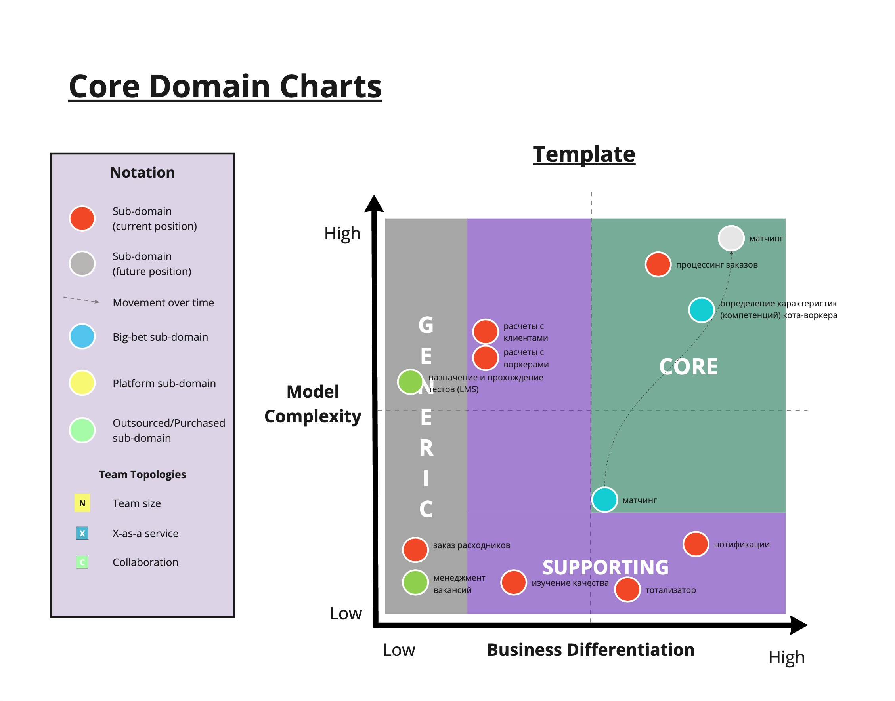

Цель проекта

она практически софрмулирована, в задании, но я попробую ее немного конкретизировать:
"Увеличение производительности котов-тестировщиков за счет уменьшения посторонней работы путем делегирования рутинных задач профессиональным исполнителям"

фактически, основной способ заработка компании - процессинг заказов

из того же конеткста задания можно выделить два конкурентных преимущества:
1. система матчинга
2. система отбора исполнителей

система отбора фактически решает три проблемы:
1. менеджмент вакансий и прием заявок
2. назначение и прохождение тестов (LMS)
3. подсчет итогов теста и характеристик (компетенций), кота-воркера

Также в требованиях упоминаются департамены:
- отдел изучения качества
- отдел расходников
    - заказ расходников
    - подбор расходников под заказы 
    - выдача расходников исполнителям (часть процессинга заказа)

итого, меем следующие поддомены:

| Вид поддомена | Конкурентное преимущество | Сложность доменной модели | Изменчивость | Комментарий
|---|---|---|---|
| процессинг заказов | нет | высокая | частая |  |
| матчинг | да | высокая | частая | |
| менеджмент вакансий и прием заявок | нет | низкая | редкая | можно интегрироваться с какой-нибудь hr crm | 
| назначение и прохождение тестов (LMS) | система - нет, методика - возможно | высокая | редкая | можно взять внешнюю, т.к. концептуально все похожи, при этом внешняя система избавит от сложностей организации контента |
| определение характеристик (компетенций) кота-воркера | да | высокая | частая |  |
| изучение качества | нет | низкая | редкая |  |
| заказ расходников | нет | низкая | редкая | готовая система складского учета, но возможно понадобятся доработки для заказа печенья под конкретный заказ, поэтому пока пусть будет внутренняя разработка |
| подбор расходников для заказов | нет | низкая | редкая |  |
| расчеты с клиентами | нет | высокая | частая |  |
| расчеты с воркерами | нет | высокая | редкая |  |
| тотализатор | нет | низкая | редкая |  |
| нотификации | нет | низкая | частая |  |

Изменения в схемах и логика принятия решений:
1. Ключевые, часто изменяющиеся элементы системы оставляем в монолите:
    - найм
    - заказы
    - матчинг - эта часть системы будет активно развиваться, сложно заранее предсказать какие еему будут нужны данные, соответственно чтобы сократить ТТМ по нему - оставим его в монолите, чтобы был максимально быстрый доступ к данным для проверки гипотез
    это даст хорошую гибкость в тестировании гипотез
2. не особо важные для бизнеса или редко изменяемые элементы выносим в отдельные сервисы. так они не будут конфликтовать за релизы в монолите и афектить на критичные для бизнеса процессы 
3. в поддомене найма используем внешние CRM и LMS внешнюю, на своей стороне реализуем только логику определения компетенций воркера и специфичную бизнес-логику вроде нотификаций. и CRM и LMS с точки зрения своих механик кажутся не сильно изменчивыми, и на рынке есть достаточно качественных решений
